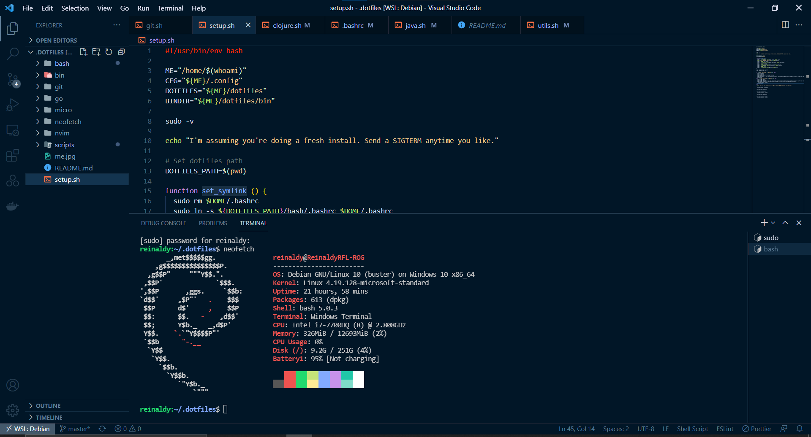

# ~/dotfiles

This is here in case anything goes wrong. I'm using WSL2 (Windows Subsystem Linux), so no window manager or something like that.

I'm not licensing it. If you want to steal a script or two, that's totally fine, even without asking my permission.

Use [issues](https://github.com/aldy505/dotfiles/issues) for any questions.

Debian (I used to use Ubuntu)


### Directory structure

```
.
├── bash            - Bash configs
├── bin             - Shortcut bash scripts
├── git             - Git configs
├── go              - Golang configs
├── micro           - Micro configs
├── neofetch        - Neofetch configs
├── nvim            - Neovim configs
├── scripts         - Installation scripts
│ 
├── me.jpg          - My Github profile picture
├── README.md       - You are here
└── setup.sh        - Entrypoint if I'm doing a fresh install
```